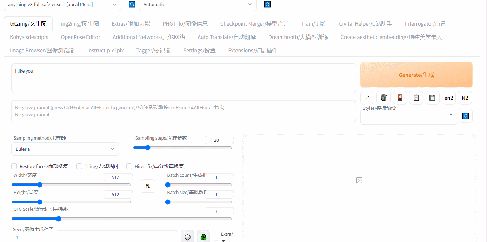
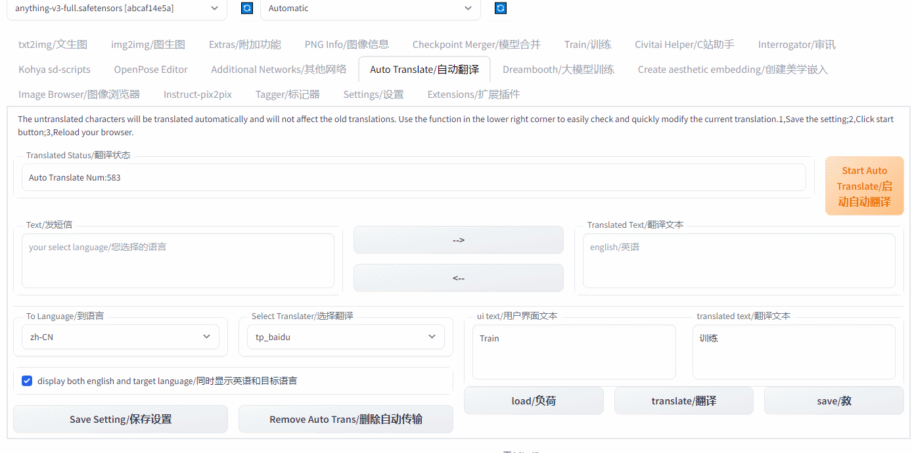
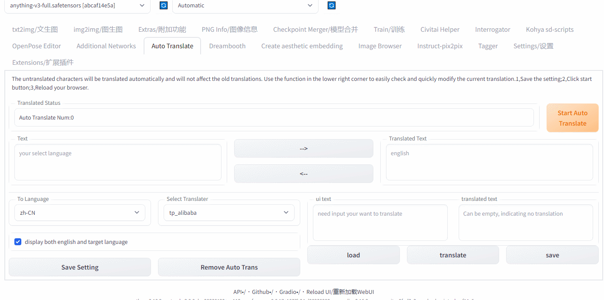

# Stable-Diffusion-Webui-Auto-Translate-Language
Language extension allows users to write prompts in their native language and automatically translate UI, without the need to manually download configuration files. New plugins can also be translated.
- This is a library which aims to bring free, multiple, enjoyable
- Easy to use, no need to set the translation appid
- The ui can be fully automated for translation
- Typing prompt no longer requires switching browsers and tab pages

- [Supported Translation Services](#supported-translation-services)
- [Installation](#installation)
- [Getting Started and Screenshots](#getting-started)
- [NetworkError]
- [License](#license)

### Getting Started
* Translate Prompt with dialog
  
* Translate Setting
  
* Auto Translate UI
  

### Installation
#### Method 1
Use the Install from URL provided by webui to install

Click in order Extensions - Install from URL

Then fill in the first text box with https://github.com/hyd998877/Stable-Diffusion-Webui-Auto-Translate-Language, click the Install button.

#### Method 2
```
git clone https://github.com/hyd998877/Stable-Diffusion-Webui-Auto-Translate-Language
cd Stable-Diffusion-Webui-Auto-Translate-Language
pip install -r requirements.txt
```

#### NetworkError

1. Check whether the network is connected correctly.
2. Check the proxy are enabled on your computer. If it is enabled, try turning it off or otherwise. 

#### License

[MIT Llicense](https://github.com/hyd998877/Stable-Diffusion-Webui-Auto-Translate-Language/blob/master/LICENSE)
